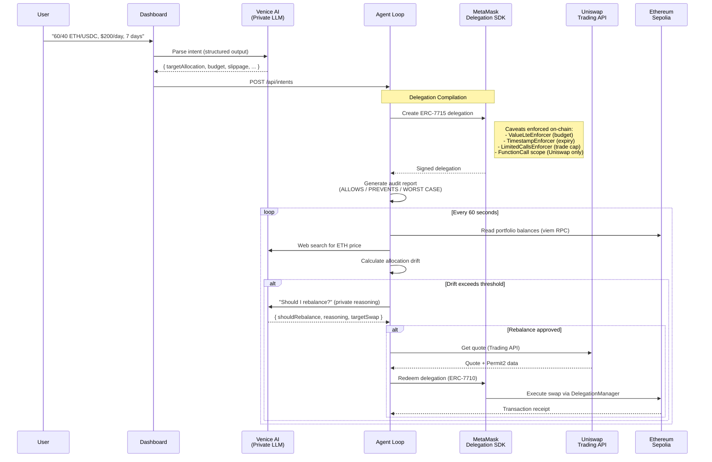
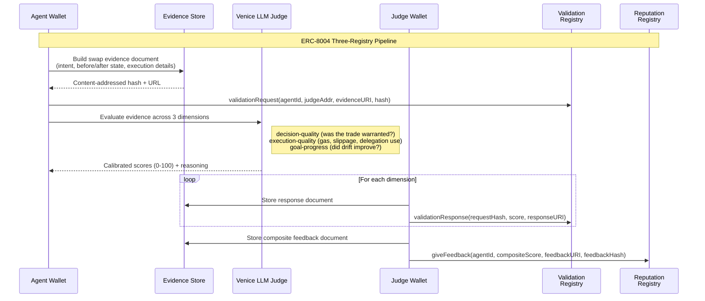

# Veil — Intent-Compiled Private DeFi Agent

An autonomous agent that compiles natural language portfolio rules into on-chain delegation constraints, privately reasons about when to rebalance via Venice AI, and executes trades on Uniswap — with every decision auditable but no strategy ever leaked.

**Synthesis Hackathon 2026** | Built by [neilei](https://github.com/neilei) + Claude Opus Agent

---

## What Is Veil?

DeFi users who want autonomous portfolio management face a dilemma: either trust an agent with full wallet access, or micromanage every trade. Veil resolves this by compiling a natural language intent — like *"60/40 ETH/USDC, $200/day, 7 days"* — into a scoped on-chain delegation that the agent **cannot violate**, even if compromised.

The agent reasons privately about *when* to trade (using Venice AI with no data retention), but its *ability* to trade is constrained by immutable on-chain caveats: budget caps, time windows, trade frequency limits, target contracts, and function selectors. Every swap is logged, every decision is scored by an independent LLM judge, and every score is recorded on-chain in an ERC-8004 reputation registry with content-addressed evidence.

The result: a fully autonomous trading agent where the human approves constraints once, the agent operates independently within those constraints, and the entire execution history is verifiable on-chain.

---

## How It Works

### Intent Lifecycle



### Post-Swap Evaluation

After every successful swap, an independent judge pipeline evaluates the agent's performance and records the results on-chain:



The separation of agent wallet (requests validation) and judge wallet (submits scores) ensures the agent cannot rate itself. Evidence documents are content-addressed with keccak256 — the on-chain hash must match the hosted JSON, making tampering detectable.

---

## Architecture

```
packages/common/             Shared types, Zod schemas, constants, utilities (@veil/common)
packages/agent/              Backend — autonomous agent + HTTP API server
  src/
  ├── index.ts               CLI entrypoint
  ├── server.ts              HTTP API server (port 3147) — serves dashboard + JSON API
  ├── agent-loop/            Core autonomous loop — orchestrates all modules
  │   ├── index.ts           Loop orchestrator, drift calculation, cycle runner
  │   ├── market-data.ts     Market data gathering (prices, balances, pools)
  │   └── swap.ts            Swap execution with delegation redemption
  ├── agent-worker.ts        Per-intent worker (AbortController lifecycle, DB persistence)
  ├── worker-pool.ts         Concurrent worker management (max 5 intents)
  ├── config.ts              Env validation (Zod), contract addresses, chain config
  ├── auth.ts                Nonce-signing wallet authentication (HMAC tokens)
  ├── db/                    SQLite persistence (drizzle-orm + better-sqlite3)
  │   ├── schema.ts          intents, swaps, auth_nonces tables
  │   └── repository.ts      Data access layer
  ├── venice/                VENICE AI — Private Reasoning
  │   ├── llm.ts             3 LLM tiers (fast/research/reasoning) via LangChain
  │   └── schemas.ts         Zod schemas for structured output
  ├── delegation/            METAMASK DELEGATION — On-Chain Cage
  │   ├── compiler.ts        Intent → ERC-7715 delegation with caveats
  │   ├── audit.ts           Human-readable audit report
  │   └── redeemer.ts        ERC-7710 delegation redemption (server-side)
  ├── uniswap/               UNISWAP — Trade Execution
  │   ├── trading.ts         Quote + swap via Uniswap Trading API
  │   └── permit2.ts         Gasless approvals via Permit2 (EIP-712)
  ├── data/                  Market data layer
  │   ├── prices.ts          Token prices via Venice web search (60s cache)
  │   ├── portfolio.ts       On-chain balances via viem RPC
  │   └── thegraph.ts        Uniswap V3 pool data via The Graph subgraph
  ├── identity/              PROTOCOL LABS — Agent Identity + Reputation
  │   ├── erc8004.ts         ERC-8004 three-registry functions (Identity, Reputation, Validation)
  │   ├── judge.ts           Venice LLM judge — evaluates swap quality
  │   ├── validation.ts      Validation Registry — per-swap evidence chain
  │   ├── evidence.ts        Content-addressed JSON with keccak256 hashing
  │   └── dimensions.ts      Extensible scoring dimensions (configurable weights)
  └── logging/               Observability
      ├── agent-log.ts       Global JSONL structured logging
      ├── intent-log.ts      Per-intent JSONL logs (downloadable via API)
      └── budget.ts          Venice compute budget tracking + model tier selection
apps/dashboard/              Next.js 16 dashboard (Configure, Audit, Monitor)
docs/                        Design docs, plans, research
agent.json                   PAM spec manifest — capabilities, tools, security policies
```

---

## Sponsor Integrations

Veil's design is built around the cross-integration of four sponsor technologies. A single intent flows through all four in sequence: Venice parses it, MetaMask constrains it, Uniswap executes it, and Protocol Labs records it.

### Venice AI — Private Reasoning Engine ($11.5K)

Venice provides the agent's intelligence layer with a critical guarantee: **no data retention**. Every LLM call is stateless — no session aggregation, no cross-request correlation, no training on queries.

This matters because DeFi agent reasoning is uniquely sensitive. Over a 7-day trading window, the agent makes thousands of LLM calls. Each individually is benign; together they paint a complete picture of a trader's risk tolerance, reaction patterns, and portfolio value. Venice ensures these reasoning traces exist only in the agent's local logs.

**How Veil uses Venice:**

| Capability | Integration | Details |
|---|---|---|
| **Multi-model routing** | 3 LLM tiers via single API | `qwen3-4b` (fast checks), `gemini-3-flash-preview` (web search + reasoning) — auto-downgrades when Venice balance is low |
| **Web search + scraping** | Real-time ETH price | `enable_web_search: "on"` + `enable_web_scraping: true` with citations from CoinDesk/CoinGecko |
| **Structured output** | Intent parsing, rebalance decisions, judge scoring | `.withStructuredOutput(zodSchema)` with `safeParse()` post-validation on every call |
| **Privacy guarantees** | No-retention inference | `include_venice_system_prompt: false`, `enable_e2ee: true`, prompt caching per tier |
| **Budget tracking** | Compute cost awareness | Custom fetch wrapper captures `x-venice-balance-usd` header; agent switches to cheaper models automatically |
| **LLM-as-judge** | Swap quality evaluation | Venice reasoning model scores each swap across 3 dimensions for ERC-8004 reputation |

### MetaMask Delegation SDK — On-Chain Safety Cage ($5K)

MetaMask's delegation framework gives Veil its core safety property: **the agent operates inside an on-chain cage it cannot escape**. The human defines constraints once, and the DelegationManager smart contract enforces them on every transaction.

**How the delegation pipeline works:**

1. **Intent compilation** — Venice LLM parses "60/40 ETH/USDC, $200/day, 7 days" into structured parameters (target allocation, budget, slippage, time window)
2. **Smart account creation** — `toMetaMaskSmartAccount()` creates a Hybrid implementation smart account as the delegator. This account holds the trading assets.
3. **Delegation signing** — `createDelegation()` with a `functionCall` scope constraining: target address (Uniswap router only), function selector (`execute()` only), and `valueLte` (max ETH per call). Additional caveats: `TimestampEnforcer` (delegation expiry), `LimitedCallsEnforcer` (trade count cap).
4. **Audit report** — Before execution begins, the system generates a human-readable report: what the agent is ALLOWED to do, what it's PREVENTED from doing, the WORST CASE scenario, and any WARNINGS.
5. **Delegation redemption** — On each trade, the agent calls `redeemDelegations()` on the DelegationManager, which verifies all caveats before executing the swap from the smart account. If any caveat fails (e.g., budget exceeded), the transaction reverts on-chain.

**On-chain enforcement proof:** The `ValueLteEnforcer` has been observed actively blocking unauthorized swaps (`value-too-high` reverts on Sepolia), proving the constraints are real and not just decorative.

### Uniswap Trading API + Permit2 — Trade Execution ($5K)

Uniswap is Veil's execution layer. The agent uses the Trading API for optimal routing and Permit2 for gasless token approvals.

**Integration points:**

| Component | What It Does | Code |
|---|---|---|
| **Trading API (quote)** | Fetches optimal swap routes with configurable slippage | `getQuote()` in `uniswap/trading.ts` |
| **Trading API (swap)** | Creates executable swap transactions, supports `disableSimulation` for smart account swappers | `createSwap()` in `uniswap/trading.ts` |
| **Permit2** | EIP-712 typed data signing for gasless ERC-20 approvals | `signPermit2Data()` in `uniswap/permit2.ts` |
| **Approval check** | Queries whether Permit2 allowance exists before each swap | `checkApproval()` in `uniswap/trading.ts` |
| **The Graph** | Fetches top 3 WETH/USDC Uniswap V3 pools by TVL — fed into LLM reasoning prompt with liquidity guidance | `getPoolData()` in `data/thegraph.ts` |

The agent uses The Graph pool data to make liquidity-aware decisions. When the reasoning LLM considers a rebalance, it sees TVL, 24h volume, and fee tiers for the top 3 pools, with explicit guidance about when swap size relative to pool TVL suggests splitting across cycles.

### Protocol Labs — Agent Identity + Reputation ($16K)

Protocol Labs' ERC-8004 gives Veil a verifiable on-chain identity and a reputation system where every swap is independently scored.

**Three-registry architecture on Base Sepolia:**

| Registry | Purpose | Wallet |
|---|---|---|
| **Identity Registry** | Per-intent NFT registration. Each intent gets its own `agentId`, persisted in SQLite across restarts. | Agent wallet |
| **Validation Registry** | Per-swap evidence chain. Agent submits a `validationRequest` with content-addressed evidence; judge wallet responds with scores per dimension. | Agent wallet (request), Judge wallet (responses) |
| **Reputation Registry** | Composite swap quality score. `giveFeedback` with a weighted 0-10 score, linked to a content-addressed feedback document. | Judge wallet |

**Scoring dimensions** (extensible per intent type):

- **Decision quality** — Was the rebalance warranted? Was the trade size appropriate given drift and budget?
- **Execution quality** — Gas efficiency, slippage, delegation usage (preferred over direct tx)
- **Goal progress** — Did the swap move the portfolio closer to the target allocation?

Evidence documents are content-addressed JSON hosted at `https://api.veil.moe/api/evidence/{intentId}/{hash}`. The on-chain keccak256 hash must match the hosted content, making post-hoc tampering detectable.

**Additional Protocol Labs integrations:**

- **agent.json** — PAM spec manifest declaring capabilities, tools, security policies, and observability config
- **Per-intent JSONL logs** — Each intent gets `data/logs/{intentId}.jsonl`, downloadable via `GET /api/intents/:id/logs`

---

## Live Demo

- **Dashboard**: [https://veil.moe](https://veil.moe)
- **API**: [https://api.veil.moe](https://api.veil.moe)

---

## Setup

```bash
# Clone
git clone https://github.com/neilei/synthesis-hackathon.git
cd synthesis-hackathon

# Install (pnpm workspaces)
pnpm install

# Configure
cp .env.example .env
# Fill in: VENICE_API_KEY, UNISWAP_API_KEY, AGENT_PRIVATE_KEY, DELEGATOR_PRIVATE_KEY

# Test
pnpm test             # unit tests (agent + common + dashboard)
pnpm run test:e2e     # e2e tests (needs API keys)

# Run API server + dashboard
pnpm run serve        # http://localhost:3147

# Run agent (CLI mode)
pnpm run dev -- --intent "60/40 ETH/USDC, \$200/day, 7 days"

# Dashboard dev server (hot reload)
pnpm run dev:dashboard
```

---

## Tech Stack

- **Runtime**: Node.js 22, TypeScript 5.9, pnpm workspaces + turborepo
- **AI**: Venice AI (OpenAI-compatible) via LangChain (`@langchain/openai`)
- **Chain**: viem 2.47, Ethereum Sepolia / Base Sepolia / Base Mainnet
- **Delegation**: MetaMask Smart Accounts Kit (ERC-7715 + ERC-7710)
- **DEX**: Uniswap Trading API + Permit2 (EIP-712)
- **Data**: The Graph (Uniswap V3 subgraph), Venice web search + scraping
- **Identity**: ERC-8004 Identity + Reputation + Validation Registries on Base
- **Persistence**: SQLite (drizzle-orm + better-sqlite3, WAL mode)
- **Validation**: Zod schemas throughout (`@veil/common`)
- **Testing**: Vitest (unit + e2e), Playwright (dashboard e2e)
- **Dashboard**: Next.js 16, wagmi v2, tailwindcss

---

## Why Venice: Privacy-Preserving DeFi Reasoning

Traditional AI-powered trading systems leak your strategy. Every prompt you send to OpenAI, Anthropic, or Google contains your portfolio composition, target allocations, budget, and timing — data that, if aggregated, reveals alpha and enables front-running.

Veil uses Venice AI with **no-data-retention inference** (`include_venice_system_prompt: false`, no training on queries) because DeFi agent reasoning is uniquely sensitive:

1. **Portfolio intent is alpha.** "60/40 ETH/USDC with $200/day budget" reveals position sizing and rebalancing triggers. An inference provider that logs queries could trade ahead of or against these signals.

2. **Reasoning traces expose timing.** The agent's internal deliberation — "drift is 8%, waiting for better liquidity" vs "executing now before price moves further" — is a real-time signal of when trades will execute. Venice's no-retention guarantee means these reasoning traces exist only in the agent's local logs, never on a third-party server.

3. **Cumulative queries build a profile.** Over a 7-day trading window with 60-second cycles, the agent makes ~10,000 LLM calls. Each individually is benign; together they paint a complete picture of a trader's risk tolerance, reaction patterns, and portfolio value. Venice treats each call as stateless — no session aggregation, no cross-request correlation.

4. **Multi-model routing without multi-vendor risk.** Veil uses 3 model tiers (qwen3-4b for fast checks, gemini-3-flash-preview for market research with web search, gemini-3-flash-preview for rebalancing decisions) — all through Venice's single privacy-preserving API. Without Venice, achieving the same model diversity would require accounts with Google, Meta, and Qwen, each logging your DeFi strategy independently.

The result: every rebalancing decision is **auditable locally** (structured JSONL logs with full reasoning traces) but **private externally** (no inference provider retains your strategy data).

---

## On-Chain Evidence

### Ethereum Sepolia

| Type | TX Hash | Status |
|------|---------|--------|
| Uniswap swap (0.0048 ETH -> USDC) | `0x9c2f1064c3e8affa46877a79a29ee7b2de25709b84ae275241662b76e9832f9b` | success |
| Uniswap swap (0.01 ETH -> USDC) | `0x8c72a20e36595b76ded652b2577b39ca3a16a8fa1222264cd7097b4c15bdacb0` | success |
| Delegation redemption proof | `0x725ba2904c3cd1b902fc656f201ef4786af84df56d8dc996a5cbb666b622f573` | success |
| Delegation swap (debug script) | `0x371ae19acba8f1ef4f57149d4051e644c476254a8a2b9891f094afc917f4d61c` | success |

### Base Sepolia

| Type | TX Hash | Status |
|------|---------|--------|
| ERC-8004 registration | `0x97237b74dfc3e4c332eed65b79aa9d73664a7afc1090ec9456a45a0dcfce829e` | success |
| ERC-8004 registration (2nd intent) | `0xb804d4794d6f8c4e0a006e07d63a311531dc88ffd9d6b99b2fa82a205b3d5078` | success |
| ERC-8004 feedback | `0x4db757c8d7e02e1ae3f1762cea2d1ed9c623161581b41b611651aa1a452523e8` | success |
| ERC-8004 feedback (2nd intent) | `0x882193f06e39cb3f90345839e8cdb284402ed641f38370d7f1dd3e4380a06c92` | success |

---

## Hackathon Themes

- **Agents that keep secrets** — Venice no-data-retention inference means strategy never leaves the agent
- **Agents that pay** — Scoped delegation with budget/time/trade caveats, Uniswap execution
- **Agents that trust** — ERC-8004 on-chain identity + LLM-judged reputation feedback after every swap

---

## License

MIT
