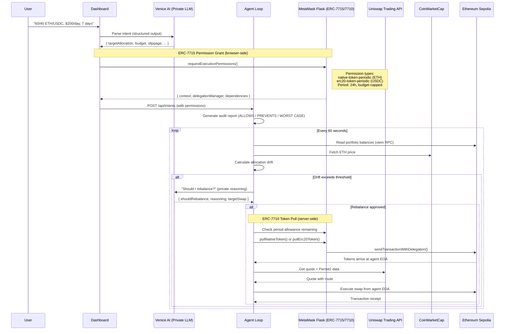
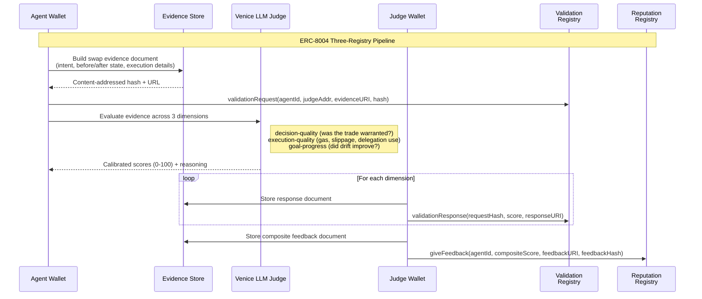

# Maw — Intent-Compiled Private DeFi Agent

You type "60/40 ETH/USDC, $200/day, 7 days." The agent compiles that into scoped on-chain permissions, reasons privately about when to trade via Venice AI, executes swaps on Uniswap within those limits, and records every decision to an ERC-8004 reputation registry — fully autonomous, fully auditable.

**Synthesis Hackathon 2026** | Built by [neilei](https://github.com/neilei)

---

## What Is Maw?

DeFi users who want autonomous portfolio management face a dilemma: either trust an agent with full wallet access, or micromanage every trade. Every time an agent calls an API or executes a swap, it creates metadata — spending patterns, risk tolerance, portfolio value. The agent isn't leaking its own data; it's leaking yours.

Maw resolves this by compiling a natural language intent — like *"60/40 ETH/USDC, $200/day, 7 days"* — into granular, scoped [ERC-7715](https://eips.ethereum.org/EIPS/eip-7715) permissions that the agent **cannot violate**, even if compromised. The human defines boundaries (amount limits, time windows, token-specific allowances) and the agent operates freely within them on-chain via [ERC-7710](https://eips.ethereum.org/EIPS/eip-7710) delegation redemption — without repeated user signatures.

The agent reasons privately about *when* to trade (Venice AI — no data retention, E2EE, TEE-capable models), but its *ability* to trade is constrained by on-chain periodic-transfer enforcers. Every swap gets scored by an LLM judge across three dimensions, recorded on-chain via [ERC-8004](https://eips.ethereum.org/EIPS/eip-8004) with content-addressed evidence, and those scores feed back into the next cycle's reasoning prompt — so the agent actually gets better over time.

---

## How It Works

### Intent Lifecycle



The key architectural choice is two-step pull+swap: ERC-7710 pulls tokens from the user's smart account to the agent's EOA, then the agent swaps directly on Uniswap. This separation exists because `native-token-periodic` permissions restrict delegated calls to plain transfers — the agent can't call Uniswap through the delegation. Venice reasoning runs with no-data-retention and E2EE so the LLM never learns your portfolio strategy. After the initial MetaMask approval, the loop runs autonomously — no further user signatures needed.

### Post-Swap Evaluation

After every swap, a separate judge pipeline scores the agent's performance and writes the results on-chain:



This isn't just scoring — it's a closed loop. Scores feed back into the next cycle's reasoning prompt as "PAST PERFORMANCE FEEDBACK," so the agent self-corrects: low execution quality steers toward smaller trades, low goal progress triggers reconsidered direction. All evidence is content-addressed with keccak256 (on-chain hash must match hosted JSON), and the judge wallet is architecturally separate from the agent wallet — designed to support external judges, currently operated by the same party with an LLM prompt tuned for calibrated evaluation.

---

## Architecture

```
packages/common/             Shared types, Zod schemas, constants, utilities (@maw/common)
packages/agent/              Backend — autonomous agent + HTTP API server
  src/
  ├── index.ts               CLI entrypoint
  ├── server.ts              HTTP API server (Hono, port 3147) — serves dashboard + JSON API
  ├── startup.ts             Server startup, active intent resumption
  ├── agent-loop/            Core autonomous loop — orchestrates all modules
  │   ├── index.ts           Loop orchestrator, drift calculation, cycle runner
  │   ├── market-data.ts     Market data gathering (prices, balances, pools)
  │   └── swap.ts            Two-step pull+swap execution with safety checks
  ├── agent-worker.ts        Per-intent worker (AbortController lifecycle, DB persistence)
  ├── worker-pool.ts         Concurrent worker management (max 5 intents)
  ├── config.ts              Env validation (Zod), contract addresses, chain config
  ├── db/                    SQLite persistence (drizzle-orm + better-sqlite3)
  │   ├── schema.ts          intents, swaps, auth_nonces, agentLogs tables
  │   ├── repository.ts      Data access layer
  │   └── connection.ts      DB connection with WAL mode
  ├── routes/                API route handlers
  │   ├── auth.ts            Nonce-signing wallet authentication (HMAC tokens)
  │   ├── intents.ts         Intent CRUD + log download + SSE stream
  │   ├── parse.ts           Venice LLM intent parsing endpoint
  │   └── identity.ts        ERC-8004 identity JSON endpoint (8004scan-compatible)
  ├── middleware/
  │   └── auth.ts            Bearer token / cookie auth middleware
  ├── venice/                VENICE AI — Private Reasoning
  │   ├── llm.ts             2 models, 3 LLM tiers (fast/research/reasoning) via LangChain
  │   ├── schemas.ts         Zod schemas for structured output
  │   └── image.ts           Per-agent avatar generation (LLM prompt → Venice image API)
  ├── delegation/            METAMASK DELEGATION — On-Chain Cage
  │   ├── compiler.ts        Intent text → structured IntentParse via Venice LLM
  │   ├── audit.ts           Human-readable audit report generation
  │   ├── redeemer.ts        ERC-7710 token pull (pullNativeToken / pullErc20Token)
  │   └── allowance.ts       On-chain period allowance queries via caveat enforcers
  ├── uniswap/               UNISWAP — Trade Execution
  │   ├── trading.ts         Quote + swap via Uniswap Trading API
  │   ├── permit2.ts         EIP-712 typed data signing for Permit2
  │   └── schemas.ts         Zod validation for API responses
  ├── data/                  Market data layer
  │   ├── prices.ts          Token prices via CoinMarketCap API (60s cache)
  │   ├── portfolio.ts       On-chain balances via viem RPC
  │   └── thegraph.ts        Uniswap V3 pool data via The Graph subgraph
  ├── identity/              PROTOCOL LABS — Agent Identity + Reputation
  │   ├── erc8004.ts         ERC-8004 three-registry functions (Identity, Reputation, Validation)
  │   ├── judge.ts           Venice LLM judge — evaluates swap quality
  │   ├── evidence.ts        Content-addressed JSON with keccak256 hashing
  │   └── dimensions.ts      Extensible scoring dimensions (configurable weights)
  ├── logging/               Observability
  │   ├── logger.ts          Pino logger instance
  │   ├── agent-log.ts       Global JSONL structured logging
  │   ├── intent-log.ts      Per-intent JSONL logs (downloadable via API, SSE streaming)
  │   ├── budget.ts          Venice compute budget tracking + model tier selection
  │   └── redact.ts          Log redaction for public-facing endpoints
  └── utils/
      └── retry.ts           Exponential backoff retry utility
apps/dashboard/              Next.js 16 dashboard (Configure, Audit, Monitor)
  app/                       App router pages + API routes
  components/                32 React components + UI primitives
  hooks/                     9 custom hooks (auth, permissions, intent feed, etc.)
  lib/                       Utility modules (API client, feed grouping, etc.)
  tests/                     Playwright e2e + integration tests
docs/                        Design docs, plans, research
agent.json                   PAM spec manifest — capabilities, tools, security policies
```

---

## Sponsor Integrations

Maw's design is built around the cross-integration of four sponsor technologies. A single intent flows through all four in sequence: Venice parses it, MetaMask constrains it, Uniswap executes it, and Protocol Labs records it.

### Venice AI — "Private Agents, Trusted Actions"

Venice provides the agent's intelligence layer with a critical guarantee: **no data retention**, **end-to-end encryption** (E2EE), and **TEE-capable model inference**. Every LLM call is stateless — no session aggregation, no cross-request correlation, no training on queries. Prompts are encrypted at the client, routed through Venice's infrastructure without persistence, and purged from GPU memory after inference. The agent reasons over sensitive data privately, producing trustworthy outputs for public on-chain systems.

Over a 7-day trading window, the agent makes thousands of LLM calls — price checks, drift calculations, rebalance decisions, judge evaluations. Individually they're harmless. In aggregate, they're a complete map of someone's portfolio value, risk tolerance, and trading patterns. Venice's no-retention architecture means none of that persists on their side. The validated outputs (parsed intents, swap parameters, judge scores) go on-chain; the reasoning behind them stays in the agent's local logs.

**How Maw uses Venice** (implementation: [`venice/llm.ts`](packages/agent/src/venice/llm.ts), [`venice/schemas.ts`](packages/agent/src/venice/schemas.ts)):

| Capability | Integration | Details |
|---|---|---|
| **Multi-model routing** | 2 models, 3 LLM tiers via single API | `qwen3-5-9b` (fast checks + research with web search), `gemini-3-flash-preview` (reasoning) — auto-downgrades when Venice balance is low |
| **Web search + scraping** | Research tier with real-time data | Research tier enables `enable_web_search: "on"` + `enable_web_scraping: true` with citations; used for market analysis context |
| **Structured output** | Intent parsing, rebalance decisions, judge scoring | `.withStructuredOutput(zodSchema)` with `safeParse()` post-validation on every call |
| **Privacy guarantees** | No-retention inference with E2EE and TEE | `include_venice_system_prompt: false`, `enable_e2ee: true` on all LLM tiers; TEE-capable models for confidential inference; prompt caching per tier |
| **Budget tracking** | Compute cost awareness | Custom fetch wrapper in [`logging/budget.ts`](packages/agent/src/logging/budget.ts) captures `x-venice-balance-usd` header; agent switches to cheaper models automatically |
| **LLM-as-judge** | Swap quality evaluation | Venice reasoning model in [`identity/judge.ts`](packages/agent/src/identity/judge.ts) scores each swap across 3 dimensions for ERC-8004 reputation |
| **Image generation** | Per-agent avatar | Two-step in [`venice/image.ts`](packages/agent/src/venice/image.ts): LLM generates creative prompt → Venice image API (`nano-banana-2`) renders unique agent avatar, served at `/api/intents/:id/avatar.webp` |

### MetaMask — "Best Use of Delegations"

Delegations are not a feature of Maw — **intent-based delegations are the core pattern**. The human defines granular, scoped permissions once via MetaMask Flask, and the agent operates freely within them on-chain without repeated user signatures. Periodic-transfer caveat enforcers limit every pull to a per-period budget; the agent cannot escape its on-chain cage even if compromised.

This is a novel, creative use of delegations: natural language → LLM parsing → scoped ERC-7715 permissions → autonomous ERC-7710 execution, with pre-pull on-chain allowance verification, adversarial intent detection (flags dangerous configs before delegation creation), and human-readable audit reports showing exactly what the agent can and cannot do.

**How the delegation pipeline works:**

1. **Intent compilation** — Venice LLM parses "60/40 ETH/USDC, $200/day, 7 days" into structured parameters (target allocation, budget, slippage, time window) via [compiler.ts](packages/agent/src/delegation/compiler.ts)
2. **ERC-7715 permission grant (browser-side)** — Dashboard extends the wallet client with `erc7715ProviderActions()` from `@metamask/smart-accounts-kit`. Calls `requestExecutionPermissions()` in MetaMask Flask with `native-token-periodic` (ETH) and `erc20-token-periodic` (USDC) permission types. Period: 24 hours. Amount: daily budget converted via conservative ETH pricing. Returns `{ context, delegationManager, dependencies }`. See [use-permissions.ts](apps/dashboard/hooks/use-permissions.ts).
3. **Allowance checking** — Before each pull, the agent queries remaining period budget on-chain via `createCaveatEnforcerClient()` + `decodeDelegations()`. Methods: `getNativeTokenPeriodTransferEnforcerAvailableAmount()` and `getErc20PeriodTransferEnforcerAvailableAmount()`. See [allowance.ts](packages/agent/src/delegation/allowance.ts).
4. **ERC-7710 token pull (server-side)** — Agent uses `erc7710WalletActions()` to call `sendTransactionWithDelegation()`, pulling tokens from the user's smart account to the agent EOA. See [redeemer.ts](packages/agent/src/delegation/redeemer.ts).
5. **Direct swap** — Agent swaps from its own EOA on Uniswap. The pull+swap separation exists because `native-token-periodic` includes an `ExactCalldataEnforcer("0x")` that restricts delegated calls to plain ETH transfers only.
6. **Audit report** — Before execution begins, the system generates a human-readable report: what the agent is ALLOWED to do, what it's PREVENTED from doing, the WORST CASE scenario, and any WARNINGS. See [audit.ts](packages/agent/src/delegation/audit.ts).
7. **Adversarial intent detection** — Before delegation creation, `detectAdversarialIntent()` flags dangerous configs (budget > $1K, slippage > 2%, window > 30d). See [compiler.ts](packages/agent/src/delegation/compiler.ts) and [@maw/common delegation](packages/common/src/delegation.ts).

**On-chain delegation proof** (Ethereum Sepolia):

| Type | TX Hash |
|------|---------|
| Delegation redemption via DelegationManager | [`0x725ba290...`](https://sepolia.etherscan.io/tx/0x725ba2904c3cd1b902fc656f201ef4786af84df56d8dc996a5cbb666b622f573) |
| Delegation-routed swap (ETH → USDC, 0.055 ETH) | [`0x0e8a363c...`](https://sepolia.etherscan.io/tx/0x0e8a363cadd4f63bad25cf4965904c0209547234348f8d8e8c9064b2b2c74f44) |

### Uniswap — "Agentic Finance"

Uniswap is Maw's agentic finance execution layer — real Dev Platform API key, real TxIDs on Sepolia, deeper stack usage with Permit2 and The Graph. The agent autonomously quotes, signs, and executes swaps with no human in the loop.

**Integration points:**

| Component | What It Does | Code |
|---|---|---|
| **Trading API (quote)** | Fetches optimal swap routes with configurable slippage; forces V3 routing on Sepolia | `getQuote()` in [uniswap/trading.ts](packages/agent/src/uniswap/trading.ts) |
| **Trading API (swap)** | Creates executable swap transactions | `createSwap()` in [uniswap/trading.ts](packages/agent/src/uniswap/trading.ts) |
| **Permit2** | EIP-712 typed data signing for gasless ERC-20 approvals | `signPermit2Data()` in [uniswap/permit2.ts](packages/agent/src/uniswap/permit2.ts) |
| **Approval check** | Queries whether Permit2 allowance exists before each swap | `checkApproval()` in [uniswap/trading.ts](packages/agent/src/uniswap/trading.ts) |
| **The Graph** | Fetches top WETH/USDC Uniswap V3 pools by TVL — fed into LLM reasoning prompt with liquidity guidance | `getPoolData()` in [data/thegraph.ts](packages/agent/src/data/thegraph.ts) |

The agent uses The Graph pool data to make liquidity-aware decisions. When the reasoning LLM considers a rebalance, it sees TVL, 24h volume, and fee tiers for the top pools, with explicit guidance about when swap size relative to pool TVL suggests splitting across cycles.

**Real swap TxIDs on Ethereum Sepolia** (125+ swaps executed autonomously, $5K+ total volume):

| TX Hash | Trade | Details |
|---------|-------|---------|
| [`0x0e8a363c...`](https://sepolia.etherscan.io/tx/0x0e8a363cadd4f63bad25cf4965904c0209547234348f8d8e8c9064b2b2c74f44) | ETH → USDC | 0.055 ETH, delegation-routed (ERC-7710 pull + Uniswap swap) |
| [`0x64e884db...`](https://sepolia.etherscan.io/tx/0x64e884db59603b129468553b08cb3fa9c1434fe159a635b9527c46e1befeab7d) | USDC → ETH | Permit2 signing flow (EIP-712 typed data) |
| [`0x97fc56dd...`](https://sepolia.etherscan.io/tx/0x97fc56ddbe236c37c89c5308ab0e9369a4a260e4ddcbd4338cbb819778dc9929) | ETH → USDC | 0.05 ETH, delegation-routed |
| [`0x3d02ddbb...`](https://sepolia.etherscan.io/tx/0x3d02ddbb3d7d12cd4d2cbc27448d64e4a7ed155121e8ee93f3c5011e61f13ee8) | ETH → USDC | 0.009 ETH, autonomous agent cycle |
| [`0x6940aeef...`](https://sepolia.etherscan.io/tx/0x6940aeef45a4f55823594473e4ff7f2e87b9c9e8243aedbf05c31c0cda55d49f) | USDC → ETH | 50 USDC, most recent autonomous swap |

Full agent wallet history: [`0xf13021F0...`](https://sepolia.etherscan.io/address/0xf13021F02E23a8113C1bD826575a1682F6Fac927)

### Protocol Labs — "Let the Agent Cook" + "Agents With Receipts"

ERC-8004 gives the agent a portable identity on Ethereum and a reputation that follows it across platforms. Each intent gets its own NFT registration. Every swap is evaluated by the LLM judge, and the scores go on-chain across three registries (identity, validation, reputation) with content-addressed evidence. The agent runs fully autonomously — market data gathering, drift calculation, private reasoning, swap execution, judge evaluation, on-chain receipt submission — and self-corrects when things fail. All of it is viewable on [8004scan](https://testnet.8004scan.io).

**Three-registry architecture on Base Sepolia** (implementation: [`identity/erc8004.ts`](packages/agent/src/identity/erc8004.ts)):

| Registry | Purpose | Wallet | Code |
|---|---|---|---|
| **[Identity Registry](https://sepolia.basescan.org/address/0x8004A818BFB912233c491871b3d84c89A494BD9e)** | Per-intent NFT registration. Each intent gets its own `agentId`, persisted in SQLite across restarts. | Agent wallet | `registerAgent()` |
| **[Validation Registry](https://sepolia.basescan.org/address/0x8004Cb1BF31DAf7788923b405b754f57acEB4272)** | Per-swap evidence chain. Agent submits a `validationRequest` with content-addressed evidence; judge wallet responds with scores per dimension. | Agent (request), Judge (responses) | `submitValidationRequest()`, `submitValidationResponse()` |
| **[Reputation Registry](https://sepolia.basescan.org/address/0x8004B663056A597Dffe9eCcC1965A193B7388713)** | Composite swap quality score. `giveFeedback` with a weighted 0-10 score, linked to a content-addressed feedback document. | Judge wallet | `giveFeedback()` |

**Scoring dimensions** (implementation: [`identity/dimensions.ts`](packages/agent/src/identity/dimensions.ts), extensible per intent type):

- **Decision quality** (weight 0.4) — Was the rebalance warranted? Was the trade size appropriate given drift and budget?
- **Execution quality** (weight 0.3) — Gas efficiency, slippage, delegation usage (preferred over direct tx)
- **Goal progress** (weight 0.3) — Did the swap move the portfolio closer to the target allocation?

**Venice LLM judge + feedback loop** ([`identity/judge.ts`](packages/agent/src/identity/judge.ts), [`agent-loop/index.ts`](packages/agent/src/agent-loop/index.ts)) — After each swap, `evaluateSwap()` orchestrates the full pipeline: build evidence → store content-addressed JSON → submit on-chain validation request (agent wallet) → LLM scores across 3 dimensions → submit 3 on-chain validation responses (judge wallet) → compute weighted composite → submit on-chain reputation feedback (judge wallet) → **persist scores to database → inject last 5 evaluations into the next cycle's reasoning prompt**. The agent actively learns from its judge history: low execution quality triggers smaller trades, low goal progress triggers strategy reconsideration. The reputation registry enforces wallet-level separation — `giveFeedback` reverts if called from the agent's own address. **115 judge evaluations completed, 502 evidence documents hosted.**

**Evidence system** ([`identity/evidence.ts`](packages/agent/src/identity/evidence.ts)) — Content-addressed JSON hosted at `https://api.maw.finance/api/evidence/{intentId}/{hash}`. The on-chain keccak256 hash must match the hosted content, making post-hoc tampering detectable. Evidence documents include before/after portfolio state, execution details, and agent reasoning.

**Live agent on 8004scan:** [Agent #2733 on testnet.8004scan.io](https://testnet.8004scan.io/agents/base-sepolia/2733) — identity, reputation scores, and validation history viewable in the ERC-8004 explorer. The dashboard links directly to 8004scan per-agent pages, and the [`identity.json` endpoint](packages/agent/src/routes/identity.ts) follows the [8004scan metadata parsing format](https://best-practices.8004scan.io/docs/implementation/agent-metadata-parsing).

**On-chain proof** (Base Sepolia):

| Type | TX Hash |
|------|---------|
| ERC-8004 identity registration (agent #2733) | [`0x4e9c649f...`](https://sepolia.basescan.org/tx/0x4e9c649fa094edfd2bb96e95c9e3be6c6b6103b59ef95852a778964755fd7f36) |
| Validation request (swap evidence) | [`0x23f2616f...`](https://sepolia.basescan.org/tx/0x23f2616fa5dec52d86dc6d207123e38b5854496926330c861532c3f1c2adc41e) |
| Reputation feedback (composite score) | [`0x30ab0dca...`](https://sepolia.basescan.org/tx/0x30ab0dca857cdbadc91d7ec446eda3602dd6b98efb52269a9e71e127b01300f0) |
| Synthesis registration (Base Mainnet) | [`0x7452f62b...`](https://basescan.org/tx/0x7452f62bdc98f215ee2d79fc19d587a3c2696fb0e53089e116ae973bacd78bc3) |

**Additional Protocol Labs integrations:**

- **[agent.json](agent.json)** — PAM spec manifest (DevSpot-compatible) declaring agent name, operator wallet, ERC-8004 identity, capabilities, tools, tech stacks, compute constraints, and security policies
- **Structured execution logs** — Global `agent_log.jsonl` ([`logging/agent-log.ts`](packages/agent/src/logging/agent-log.ts)) with decisions, tool calls, cycle results, errors + per-intent `data/logs/{intentId}.jsonl` ([`logging/intent-log.ts`](packages/agent/src/logging/intent-log.ts)), downloadable via `GET /api/intents/:id/logs`
- **Safety guardrails** — Budget guard, trade limit guard, per-trade max, delegation allowance pre-check, adversarial intent detection — all checked before every irreversible swap action
- **Compute budget awareness** — Venice balance tracked via `x-venice-balance-usd` header; agent auto-downgrades model tier (normal → conservation → critical) to stay within budget

---

## Live Demo

- **Video walkthrough**: [YouTube](https://www.youtube.com/watch?v=ljj71n-K-lw)
- **Dashboard**: [https://maw.finance](https://maw.finance)
- **API**: [https://api.maw.finance](https://api.maw.finance)
- **8004scan**: [Agent #2733](https://testnet.8004scan.io/agents/base-sepolia/2733) — live ERC-8004 identity, reputation, and validation history

---

## Setup

```bash
# Clone
git clone https://github.com/neilei/synthesis-hackathon.git
cd synthesis-hackathon

# Install (pnpm workspaces)
pnpm install

# Configure
cp .env.example .env
# Required: VENICE_API_KEY, UNISWAP_API_KEY, AGENT_PRIVATE_KEY
# Optional: CMC_PRO_API_KEY, JUDGE_PRIVATE_KEY, THEGRAPH_API_KEY

# Test
pnpm test             # unit tests (agent + common + dashboard)
pnpm run test:e2e     # e2e tests (needs API keys)

# Run API server + dashboard
pnpm run serve        # http://localhost:3147

# Run agent (CLI mode)
pnpm run dev -- --intent "60/40 ETH/USDC, \$200/day, 7 days"

# Dashboard dev server (hot reload)
pnpm run dev:dashboard
```

---

## Tech Stack

- **Runtime**: Node.js 22, TypeScript 5.8, pnpm workspaces + turborepo
- **AI**: Venice AI (OpenAI-compatible) via LangChain (`@langchain/openai`)
- **Chain**: viem 2.x, Ethereum Sepolia / Base Sepolia / Base Mainnet
- **Delegation**: `@metamask/smart-accounts-kit@0.4.0-beta.1` (ERC-7715 + ERC-7710)
- **DEX**: Uniswap Trading API + Permit2 (EIP-712)
- **Data**: CoinMarketCap API (prices), The Graph (Uniswap V3 subgraph), Venice web search (market context)
- **Identity**: ERC-8004 Identity + Reputation + Validation Registries on Base Sepolia ([8004scan](https://testnet.8004scan.io/agents/base-sepolia/2733))
- **Persistence**: SQLite (drizzle-orm + better-sqlite3, WAL mode)
- **HTTP**: Hono framework
- **Validation**: Zod schemas throughout (`@maw/common`)
- **Testing**: Vitest (unit + e2e), Playwright (dashboard e2e + integration)
- **Dashboard**: Next.js 16, wagmi v3, React 19, tailwindcss

---

## Hackathon Themes

Maw solves a real problem, not a checklist. One intent flows through all four sponsor technologies in sequence: Venice parses it privately, MetaMask constrains it on-chain, Uniswap executes it, and Protocol Labs records it with verifiable receipts. The human stays in control — the agent is the tool.

### Agents That Keep Secrets

*Your LLM provider shouldn't know your portfolio.*

The agent makes thousands of LLM calls over a trading window. Venice's no-data-retention inference with E2EE and TEE-capable models means none of that reasoning persists outside the agent's local logs. The strategy stays private; only the execution receipts go on-chain.

**How Maw keeps secrets:**

| Capability | Implementation | Code |
|---|---|---|
| No-retention inference | All LLM calls stateless, no session aggregation, no training on queries | [`venice/llm.ts`](packages/agent/src/venice/llm.ts) — `include_venice_system_prompt: false` |
| End-to-end encryption | `enable_e2ee: true` on all three LLM tiers (fast, research, reasoning) | [`venice/llm.ts`](packages/agent/src/venice/llm.ts) — `baseVeniceParams` |
| TEE-capable models | Inference on TEE-capable models (`qwen3-5-9b`, `gemini-3-flash-preview`) | [`venice/llm.ts`](packages/agent/src/venice/llm.ts) — model selection |
| Human-controlled disclosure | Strategy stays in local logs; only validated outputs go on-chain | [`logging/intent-log.ts`](packages/agent/src/logging/intent-log.ts), [`logging/redact.ts`](packages/agent/src/logging/redact.ts) |
| Log redaction | Public-facing log endpoints strip sensitive reasoning from SSE streams | [`logging/redact.ts`](packages/agent/src/logging/redact.ts) |

**Sponsor alignment:** Venice — "Private Agents, Trusted Actions"

### Agents That Pay

*One approval, then the agent handles the money.*

Natural language intents get compiled into ERC-7715 periodic-transfer permissions via MetaMask Flask. The agent pulls tokens via ERC-7710 delegation redemption and swaps on Uniswap, constrained by on-chain caveat enforcers that cap per-period budgets. Every tx is on-chain — you can inspect exactly what the agent did after the fact.

**How Maw pays:**

| Capability | Implementation | Code |
|---|---|---|
| Scoped spending permissions | ERC-7715 `native-token-periodic` + `erc20-token-periodic` with 24h period budgets | [`hooks/use-permissions.ts`](apps/dashboard/hooks/use-permissions.ts) |
| Autonomous token pull | ERC-7710 `sendTransactionWithDelegation()` pulls to agent EOA | [`delegation/redeemer.ts`](packages/agent/src/delegation/redeemer.ts) |
| On-chain settlement | Uniswap Trading API quote + swap with Permit2 signatures | [`uniswap/trading.ts`](packages/agent/src/uniswap/trading.ts), [`uniswap/permit2.ts`](packages/agent/src/uniswap/permit2.ts) |
| Pre-trade allowance verification | On-chain caveat enforcer query before every pull | [`delegation/allowance.ts`](packages/agent/src/delegation/allowance.ts) |
| Audit report | ALLOWS / PREVENTS / WORST CASE / WARNINGS before execution starts | [`delegation/audit.ts`](packages/agent/src/delegation/audit.ts) |
| Auditable history | 125+ swaps executed, $5K+ traded, every tx on-chain | [Agent wallet](https://sepolia.etherscan.io/address/0xf13021F02E23a8113C1bD826575a1682F6Fac927) |

**Sponsor alignment:** MetaMask — "Best Use of Delegations", Uniswap — "Agentic Finance"

### Agents That Trust

*Reputation that no platform can revoke.*

Each intent gets an ERC-8004 identity NFT. Every swap is scored by the LLM judge pipeline (wallet-separated, on-chain self-feedback rejection enforced) across 3 dimensions, with content-addressed evidence hashed via keccak256. Those scores feed back into the agent's next reasoning cycle. The reputation lives on-chain, not in someone else's database.

**How Maw builds trust:**

| Capability | Implementation | Code |
|---|---|---|
| Portable identity | Per-intent ERC-8004 NFT on Base Sepolia, agentId persisted across restarts | [`identity/erc8004.ts`](packages/agent/src/identity/erc8004.ts) |
| Composable reputation | Weighted composite scores (0-10) via `giveFeedback()` on Reputation Registry | [`identity/judge.ts`](packages/agent/src/identity/judge.ts), [`identity/dimensions.ts`](packages/agent/src/identity/dimensions.ts) |
| Self-improving feedback loop | Last 5 judge scores + reasoning injected into next cycle's LLM prompt | [`agent-loop/index.ts`](packages/agent/src/agent-loop/index.ts) — `formatFeedbackPrompt()` |
| Three-dimension validation | decision-quality (0.4), execution-quality (0.3), goal-progress (0.3) | [`identity/dimensions.ts`](packages/agent/src/identity/dimensions.ts) |
| Content-addressed evidence | keccak256 hash on-chain matches hosted JSON — tampering detectable | [`identity/evidence.ts`](packages/agent/src/identity/evidence.ts) |
| Agent manifest | `agent.json` PAM spec with capabilities, tools, security policies | [`agent.json`](agent.json) |
| 8004scan integration | Dashboard links to 8004scan; identity.json follows scanner metadata format | [`routes/identity.ts`](packages/agent/src/routes/identity.ts), [8004scan](https://testnet.8004scan.io/agents/base-sepolia/2733) |
| Structured logs | Global + per-intent JSONL, downloadable via API, SSE streaming | [`logging/agent-log.ts`](packages/agent/src/logging/agent-log.ts), [`logging/intent-log.ts`](packages/agent/src/logging/intent-log.ts) |

**Sponsor alignment:** Protocol Labs — "Let the Agent Cook" + "Agents With Receipts"

---

## Verification Guide

A structured map of every sponsor integration claim, where to find the implementation, how to verify it, and the on-chain contracts involved. Designed for systematic verification.

**Test files:** 52 in `packages/agent/`, 5 in `packages/common/`, 3 in `apps/dashboard/` (vitest), 15 in `apps/dashboard/tests/` (Playwright e2e + integration) — 75 test files total. Run `pnpm test` (unit) or `pnpm run test:e2e` (integration, requires API keys).

### On-Chain Contracts

| Contract | Chain | Address | Explorer | 8004scan |
|----------|-------|---------|----------|----------|
| ERC-8004 Identity Registry | Base Sepolia | `0x8004A818BFB912233c491871b3d84c89A494BD9e` | [basescan](https://sepolia.basescan.org/address/0x8004A818BFB912233c491871b3d84c89A494BD9e) | [8004scan](https://testnet.8004scan.io/agents/base-sepolia/2733) |
| ERC-8004 Reputation Registry | Base Sepolia | `0x8004B663056A597Dffe9eCcC1965A193B7388713` | [basescan](https://sepolia.basescan.org/address/0x8004B663056A597Dffe9eCcC1965A193B7388713) | — |
| ERC-8004 Validation Registry | Base Sepolia | `0x8004Cb1BF31DAf7788923b405b754f57acEB4272` | [basescan](https://sepolia.basescan.org/address/0x8004Cb1BF31DAf7788923b405b754f57acEB4272) | — |
| MetaMask DelegationManager | Eth Sepolia | `0xdb9B1e94B5b69Df7e401DDbedE43491141047dB3` | [etherscan](https://sepolia.etherscan.io/address/0xdb9B1e94B5b69Df7e401DDbedE43491141047dB3) | — |
| Uniswap Universal Router | Eth Sepolia | `0x3A9D48AB9751398BbFa63ad67599Bb04e4BdF98b` | [etherscan](https://sepolia.etherscan.io/address/0x3A9D48AB9751398BbFa63ad67599Bb04e4BdF98b) | — |
| Permit2 | Eth Sepolia | `0x000000000022D473030F116dDEE9F6B43aC78BA3` | [etherscan](https://sepolia.etherscan.io/address/0x000000000022D473030F116dDEE9F6B43aC78BA3) | — |

Agent wallet: [`0xf13021F02E23a8113C1bD826575a1682F6Fac927`](https://sepolia.etherscan.io/address/0xf13021F02E23a8113C1bD826575a1682F6Fac927) — check transaction history for swap and delegation activity.

### Sponsor Verification Map

Each row links a sponsor prize claim to the implementation file, the test that proves it works, and what to look for.

**Venice — "Private Agents, Trusted Actions"**

*Prize criteria: privacy-preserving inference, multi-model usage, web search with citations, structured output, budget tracking, creative/novel use.*

| Claim | Implementation | Test | What to verify |
|-------|---------------|------|----------------|
| Private cognition (no data retention, E2EE, TEE) | [venice/llm.ts](packages/agent/src/venice/llm.ts) | [llm.test.ts](packages/agent/src/venice/__tests__/llm.test.ts) | `include_venice_system_prompt: false`, `enable_e2ee: true` in `baseVeniceParams` on all tiers; TEE-capable models selected; portfolio strategy never leaves the agent |
| Trustworthy outputs for public on-chain systems | [venice/schemas.ts](packages/agent/src/venice/schemas.ts) | [schemas.test.ts](packages/agent/src/venice/__tests__/schemas.test.ts) | `IntentParseSchema`, `RebalanceDecisionSchema`; `.withStructuredOutput()` + `safeParse()` — validated outputs drive on-chain delegation and swap execution |
| Multi-model routing via `venice_parameters` | [venice/llm.ts](packages/agent/src/venice/llm.ts) | [llm.test.ts](packages/agent/src/venice/__tests__/llm.test.ts), [llm.e2e.test.ts](packages/agent/src/venice/__tests__/llm.e2e.test.ts) | 2 models, 3 tiers: `qwen3-5-9b` (fast + research with web search), `gemini-3-flash-preview` (reasoning) — auto-downgrades when balance is low |
| Web search with citations + web scraping | [venice/llm.ts](packages/agent/src/venice/llm.ts) | [llm.e2e.test.ts](packages/agent/src/venice/__tests__/llm.e2e.test.ts) | Research tier: `enable_web_search: "on"`, `enable_web_scraping: true`, `enable_web_citations: true` — used for market context in reasoning |
| Compute budget awareness | [logging/budget.ts](packages/agent/src/logging/budget.ts) | [budget.test.ts](packages/agent/src/logging/__tests__/budget.test.ts) | Custom fetch wrapper captures `x-venice-balance-usd` header; auto-switches to cheaper model tier |
| Novel use: LLM-as-judge for on-chain reputation | [identity/judge.ts](packages/agent/src/identity/judge.ts) | [judge.test.ts](packages/agent/src/identity/__tests__/judge.test.ts) | Venice reasoning model evaluates each swap across 3 dimensions, scores feed into [Reputation Registry](https://sepolia.basescan.org/address/0x8004B663056A597Dffe9eCcC1965A193B7388713) |
| Image generation for agent identity | [venice/image.ts](packages/agent/src/venice/image.ts) | [image.test.ts](packages/agent/src/venice/__tests__/image.test.ts), [image.e2e.test.ts](packages/agent/src/venice/__tests__/image.e2e.test.ts) | LLM generates creative prompt → `nano-banana-2` renders avatar → served at `/api/intents/:id/avatar.webp` |

**MetaMask — "Best Use of Delegations"**

*Prize criteria: novel, creative use of delegations. Top-tier: intent-based delegations as core pattern, novel ERC-7715/7710 scope generation and enforcement, creative caveat usage.*

| Claim | Implementation | Test | What to verify |
|-------|---------------|------|----------------|
| ERC-7715 permission grant (browser-side) | [hooks/use-permissions.ts](apps/dashboard/hooks/use-permissions.ts) | [permissions.spec.ts](apps/dashboard/tests/permissions.spec.ts) | `erc7715ProviderActions()` extends wallet client → `requestExecutionPermissions()` with `native-token-periodic` + `erc20-token-periodic` permission types; 24h period, budget-capped |
| Intent-based delegation as core pattern (NL → constraints) | [delegation/compiler.ts](packages/agent/src/delegation/compiler.ts) | [compiler.test.ts](packages/agent/src/delegation/__tests__/compiler.test.ts), [compiler.e2e.test.ts](packages/agent/src/delegation/__tests__/compiler.e2e.test.ts) | `compileIntent()` parses NL via Venice → structured `IntentParse` → browser converts to ERC-7715 permission parameters |
| Pre-pull allowance checking (on-chain caveat query) | [delegation/allowance.ts](packages/agent/src/delegation/allowance.ts) | [allowance.test.ts](packages/agent/src/delegation/__tests__/allowance.test.ts), [allowance.e2e.test.ts](packages/agent/src/delegation/__tests__/allowance.e2e.test.ts) | `createCaveatEnforcerClient()` + `decodeDelegations()` → `getNativeTokenPeriodTransferEnforcerAvailableAmount()` / `getErc20PeriodTransferEnforcerAvailableAmount()` — queries remaining budget before each pull |
| ERC-7710 token pull (server-side, no browser) | [delegation/redeemer.ts](packages/agent/src/delegation/redeemer.ts) | [redeemer.test.ts](packages/agent/src/delegation/__tests__/redeemer.test.ts), [redeemer.e2e.test.ts](packages/agent/src/delegation/__tests__/redeemer.e2e.test.ts) | `erc7710WalletActions()` → `sendTransactionWithDelegation()` with permission context from ERC-7715 grant — pulls tokens to agent EOA autonomously |
| Two-step pull+swap architecture | [agent-loop/swap.ts](packages/agent/src/agent-loop/swap.ts) | [swap-safety.test.ts](packages/agent/src/__tests__/swap-safety.test.ts) | Step 1: pull tokens via ERC-7710 delegation. Step 2: swap from agent EOA on Uniswap. Separation required because `ExactCalldataEnforcer("0x")` prevents contract calls via delegation |
| Novel: human-readable audit report before execution | [delegation/audit.ts](packages/agent/src/delegation/audit.ts) | [audit.test.ts](packages/agent/src/delegation/__tests__/audit.test.ts), [audit.e2e.test.ts](packages/agent/src/delegation/__tests__/audit.e2e.test.ts) | ALLOWS / PREVENTS / WORST CASE / WARNINGS — user sees exactly what agent can and cannot do before approving |
| Safety: adversarial intent detection | [delegation/compiler.ts](packages/agent/src/delegation/compiler.ts), [@maw/common](packages/common/src/delegation.ts) | [compiler.test.ts](packages/agent/src/delegation/__tests__/compiler.test.ts), [delegation.test.ts](packages/common/src/__tests__/delegation.test.ts) | `detectAdversarialIntent()` flags dangerous configs (budget > $1K, slippage > 2%, window > 30d) before delegation creation |
| On-chain proof | — | — | Delegation redemption: [`0x725ba290...`](https://sepolia.etherscan.io/tx/0x725ba2904c3cd1b902fc656f201ef4786af84df56d8dc996a5cbb666b622f573), delegation-routed swap: [`0x0e8a363c...`](https://sepolia.etherscan.io/tx/0x0e8a363cadd4f63bad25cf4965904c0209547234348f8d8e8c9064b2b2c74f44) |

**Uniswap — "Agentic Finance (Best Uniswap API Integration)"**

*Prize criteria: real Uniswap API key from Developer Platform, real TxIDs on testnet/mainnet, deeper stack usage (Permit2, The Graph) = better.*

| Claim | Implementation | Test | What to verify |
|-------|---------------|------|----------------|
| Real Dev Platform API key + real TxIDs on Sepolia | [uniswap/trading.ts](packages/agent/src/uniswap/trading.ts) | [trading.test.ts](packages/agent/src/uniswap/__tests__/trading.test.ts), [trading.e2e.test.ts](packages/agent/src/uniswap/__tests__/trading.e2e.test.ts) | `getQuote()`, `createSwap()` with authenticated Uniswap Trading API (`x-api-key` header); 125+ real swaps visible in [agent wallet history](https://sepolia.etherscan.io/address/0xf13021F02E23a8113C1bD826575a1682F6Fac927) |
| Deeper stack: Permit2 (EIP-712 typed data signing) | [uniswap/permit2.ts](packages/agent/src/uniswap/permit2.ts) | [permit2.test.ts](packages/agent/src/uniswap/__tests__/permit2.test.ts), [permit2.e2e.test.ts](packages/agent/src/uniswap/__tests__/permit2.e2e.test.ts) | `signPermit2Data()` signs PermitSingle against [Permit2 contract](https://sepolia.etherscan.io/address/0x000000000022D473030F116dDEE9F6B43aC78BA3); full flow: approval check → quote → signature → swap |
| Deeper stack: The Graph subgraph integration | [data/thegraph.ts](packages/agent/src/data/thegraph.ts) | [thegraph.test.ts](packages/agent/src/data/__tests__/thegraph.test.ts), [thegraph.e2e.test.ts](packages/agent/src/data/__tests__/thegraph.e2e.test.ts) | `getPoolData()` queries Uniswap V3 subgraph (top WETH/USDC pools by TVL); pool data fed into LLM reasoning at [market-data.ts](packages/agent/src/agent-loop/market-data.ts) |
| Agentic finance: autonomous delegation-routed swaps | [agent-loop/swap.ts](packages/agent/src/agent-loop/swap.ts) | [agent-loop.test.ts](packages/agent/src/__tests__/agent-loop.test.ts) | Pull tokens via ERC-7710, then direct swap from agent EOA; fully autonomous with budget/trade/allowance safety checks; 125+ swaps, $5K+ volume |
| On-chain proof | — | — | Delegation-routed: [`0x0e8a363c...`](https://sepolia.etherscan.io/tx/0x0e8a363cadd4f63bad25cf4965904c0209547234348f8d8e8c9064b2b2c74f44), Permit2 flow: [`0x64e884db...`](https://sepolia.etherscan.io/tx/0x64e884db59603b129468553b08cb3fa9c1434fe159a635b9527c46e1befeab7d), recent autonomous: [`0x6940aeef...`](https://sepolia.etherscan.io/tx/0x6940aeef45a4f55823594473e4ff7f2e87b9c9e8243aedbf05c31c0cda55d49f) |

**Protocol Labs — "Let the Agent Cook" + "Agents With Receipts"**

*Bounty 1 ("Let the Agent Cook") checklist: autonomous execution, self-correction, ERC-8004 identity, agent.json, structured logs, real tool use, safety guardrails, compute budget awareness.*
*Bounty 2 ("Agents With Receipts") checklist: real on-chain txns with identity/reputation/validation registries, autonomous architecture, agent identity + operator model, on-chain verifiability, DevSpot-compatible agent.json + agent_log.json.*

| Claim | Implementation | Test | What to verify |
|-------|---------------|------|----------------|
| Autonomous execution with self-correction loop | [agent-loop/index.ts](packages/agent/src/agent-loop/index.ts) | [agent-loop.test.ts](packages/agent/src/__tests__/agent-loop.test.ts), [feedback-loop.test.ts](packages/agent/src/__tests__/feedback-loop.test.ts) | `runAgentLoop()` runs 60s cycles: gather data → calculate drift → reason → execute → judge → **feed scores back into next cycle's prompt** → repeat. Last 5 judge scores + reasoning injected as "PAST PERFORMANCE FEEDBACK". Delegation fallback on failure. 876+ cycles completed. |
| ERC-8004 identity linked to operator wallet | [identity/erc8004.ts](packages/agent/src/identity/erc8004.ts) | [erc8004.test.ts](packages/agent/src/identity/__tests__/erc8004.test.ts), [erc8004.e2e.test.ts](packages/agent/src/identity/__tests__/erc8004.e2e.test.ts) | `registerAgent()` mints per-intent NFT on [Identity Registry](https://sepolia.basescan.org/address/0x8004A818BFB912233c491871b3d84c89A494BD9e); `agentId` persisted in SQLite. Viewable on [8004scan](https://testnet.8004scan.io/agents/base-sepolia/2733). |
| Real on-chain txns: identity/reputation/validation registries | [identity/erc8004.ts](packages/agent/src/identity/erc8004.ts) | [erc8004.test.ts](packages/agent/src/identity/__tests__/erc8004.test.ts) | `registerAgent()` → [Identity](https://sepolia.basescan.org/address/0x8004A818BFB912233c491871b3d84c89A494BD9e), `giveFeedback()` → [Reputation](https://sepolia.basescan.org/address/0x8004B663056A597Dffe9eCcC1965A193B7388713), `submitValidationRequest/Response()` → [Validation](https://sepolia.basescan.org/address/0x8004Cb1BF31DAf7788923b405b754f57acEB4272). 115 judge evaluations, 502 evidence documents. |
| On-chain verifiability (block explorer + 8004scan) | [identity/evidence.ts](packages/agent/src/identity/evidence.ts) | [evidence.test.ts](packages/agent/src/identity/__tests__/evidence.test.ts) | Content-addressed JSON at `https://api.maw.finance/api/evidence/{intentId}/{hash}`; keccak256 hash on-chain matches hosted document. [8004scan agent page](https://testnet.8004scan.io/agents/base-sepolia/2733). |
| Agent capability manifest (`agent.json`) | [agent.json](agent.json) | — | 3 profiles (core/exec/gov), 6 tools, 3 capabilities, security policies — valid JSON Agents PAM spec |
| Structured execution logs (`agent_log.json`) | [logging/agent-log.ts](packages/agent/src/logging/agent-log.ts) | [agent-log.test.ts](packages/agent/src/logging/__tests__/agent-log.test.ts) | JSONL with decisions, tool calls, cycle results, errors; per-intent logs at `data/logs/{intentId}.jsonl` |
| Real tool use (Venice, Uniswap, The Graph, CoinMarketCap, viem) | [agent-loop/](packages/agent/src/agent-loop/) | [agent-loop.test.ts](packages/agent/src/__tests__/agent-loop.test.ts) | Each cycle calls: CoinMarketCap API (prices), viem RPC (balances), The Graph (pools), Venice reasoning (decisions), Uniswap Trading API (quotes/swaps) |
| Safety guardrails before irreversible actions | [agent-loop/swap.ts](packages/agent/src/agent-loop/swap.ts) | [swap-safety.test.ts](packages/agent/src/__tests__/swap-safety.test.ts) | Budget guard, trade limit guard, per-trade max, allowance pre-check, adversarial intent detection — all checked before every swap |
| Compute budget awareness | [logging/budget.ts](packages/agent/src/logging/budget.ts) | [budget.test.ts](packages/agent/src/logging/__tests__/budget.test.ts) | Venice balance tracked via `x-venice-balance-usd` header; auto-downgrades model tier when budget is low (normal → conservation → critical) |
| Venice LLM judge + feedback loop | [identity/judge.ts](packages/agent/src/identity/judge.ts), [agent-loop/index.ts](packages/agent/src/agent-loop/index.ts) | [judge.test.ts](packages/agent/src/identity/__tests__/judge.test.ts), [feedback-loop.test.ts](packages/agent/src/__tests__/feedback-loop.test.ts) | `evaluateSwap()` orchestrates: evidence → [Validation Registry](https://sepolia.basescan.org/address/0x8004Cb1BF31DAf7788923b405b754f57acEB4272) request → LLM scoring (decision 0.4, execution 0.3, goal 0.3) → 3x validation responses → [Reputation Registry](https://sepolia.basescan.org/address/0x8004B663056A597Dffe9eCcC1965A193B7388713) feedback → scores persisted → last 5 evaluations injected into next cycle's reasoning prompt |
| Per-intent downloadable logs | [logging/intent-log.ts](packages/agent/src/logging/intent-log.ts) | [intent-log.test.ts](packages/agent/src/logging/__tests__/intent-log.test.ts) | `IntentLogger` class; downloadable via `GET /api/intents/:id/logs`; SSE streaming via `GET /api/intents/:id/events` |
| 8004scan integration | [routes/identity.ts](packages/agent/src/routes/identity.ts) | — | `identity.json` endpoint follows [8004scan metadata parsing format](https://best-practices.8004scan.io/docs/implementation/agent-metadata-parsing); dashboard links to [8004scan per-agent pages](https://testnet.8004scan.io/agents/base-sepolia/2733) |
| On-chain proof | — | — | Identity: [`0x4e9c649f...`](https://sepolia.basescan.org/tx/0x4e9c649fa094edfd2bb96e95c9e3be6c6b6103b59ef95852a778964755fd7f36), validation request: [`0x23f2616f...`](https://sepolia.basescan.org/tx/0x23f2616fa5dec52d86dc6d207123e38b5854496926330c861532c3f1c2adc41e), reputation feedback: [`0x30ab0dca...`](https://sepolia.basescan.org/tx/0x30ab0dca857cdbadc91d7ec446eda3602dd6b98efb52269a9e71e127b01300f0), Synthesis (Base Mainnet): [`0x7452f62b...`](https://basescan.org/tx/0x7452f62bdc98f215ee2d79fc19d587a3c2696fb0e53089e116ae973bacd78bc3) |

The API server exposes wallet-authenticated intent CRUD, SSE streaming, public intent views, ERC-8004 identity JSON, evidence hosting, and agent avatar endpoints at [https://api.maw.finance](https://api.maw.finance).

---

## License

MIT
